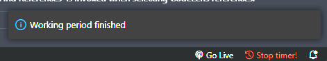
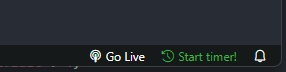
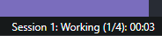

# Pomodoro Timer

🍅 Boost Your Productivity with the Ultimate Pomodoro VS Code Extension! 🚀

Introducing the perfect companion for every coder! Say goodbye to distractions and hello to hyper-focused coding sessions. 🤩

👉 Dive into the Pomodoro Technique right from your VS Code.

👉 Set custom timers to match your work rhythm.

Get ready to supercharge your coding game with the Pomodoro VS Code Extension. Stay tuned for the ultimate productivity upgrade! 🚀🍅 #CodeFocused

## Features

- [Timer Notification](#timer-notification)
- [Statusbar Icon](#statusbar-icon)
- [Statusbar session tracking](#statusbar-session-tracking)

### Timer notification
🔔 Never Miss a Beat! Timely Notifications for Your Pomodoro Sessions 🚀

Introducing a game-changer for your coding routine! Stay in sync with your Pomodoro timer like never before. 📣

- 👉 Receive instant notifications when your session is complete.
- 👉 Keep your workflow seamless, even when you're away from your code.
- 👉 Stay in control and achieve peak productivity with every Pomodoro.

Elevate your coding experience. Try out our Notification Feature and code with confidence! 🎉👨‍💻 #StayProductive
### Statusbar Icon
🚀 Streamline Your Workflow with Ease! Introducing our Status Bar Icon Feature 🕒

Tired of fumbling through menus to manage your Pomodoro sessions? We've got you covered! 🎉

- 👉 Start and stop your current session with a single click!
- 👉 Instantly access Pomodoro controls from your VS Code's status bar.
- 👉 Effortlessly stay in the flow without missing a beat.

Experience the ultimate convenience. Get ready to code like a pro with our sleek Status Bar Icon feature! 🚀💡 #ProductivitySimplified

### Statusbar session tracking
🕒 Stay on Top of Your Pomodoro Sessions with Status Bar Text Tracking! 📊

No more guessing or distractions. It's time to keep your Pomodoro progress front and center! 🚀

- 👉 Track your active Pomodoro session directly from the status bar.
- 👉 Real-time updates on your coding focus right at your fingertips.
- 👉 Stay in the zone without ever leaving your code editor.

Unlock precision and productivity like never before. Elevate your coding experience with Status Bar Text Tracking! 📈👨‍💻 #PomodoroPro

## Extension Commands
- `pomodoro.start`: Starts a new pomodoro session
- `pomodoro.stop`: Stops the current pomodoro session

## Extension Settings
- `pomodoro.workingPeriodDuration` : Duration of the working period in minutes
- `pomodoro.shortPausePeriodDuration` : Duration of the short pause in minutes
- `pomodoro.longPausePeriodDuration` : Duration of the long pause in minutes
- `pomodoro.iterations` : Amount of working periods
- `pomodoro.finishedWorkingPeriod` : Notification text after the work period
- `pomodoro.finishedShortPause` : Notification text after the short break
- `pomodoro.finishedLongBreak` : Notification text after long break
- `pomodoro.finishedSession` : Notification text after session
